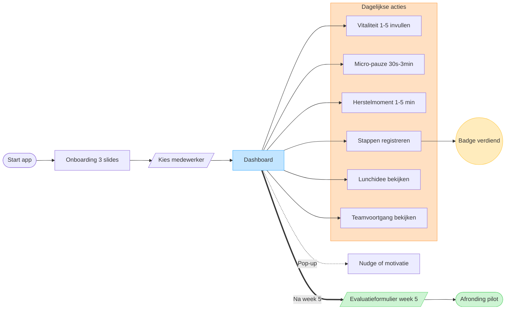

# User journey — MBRT in Balans

Visualisatie van het pad dat een medewerker doorloopt in het prototype: onboarding → dashboard hub → dagelijkse acties → week-5 evaluatie. Rendert direct in GitHub via de Mermaid-codeblock hieronder.

**FigJam-versie:** [openen in Figma](https://www.figma.com/board/qvx3ZVG1OR26E0YCMSlxFs)

## Diagram

## Leeswijzer

- **Blauw (dashboard)**: centrale hub waar elke werkdag begint.
- **Oranje (subgroep "Dagelijkse acties")**: zes acties die vanaf het dashboard direct bereikbaar zijn — vitaliteitsscore, micro-pauze, herstelmoment, stappen registreren, lunchidee, teamvoortgang.
- **Geel (badge)**: positieve beloning na een geregistreerd beweegmoment.
- **Groen (evaluatie + afronding)**: eindpunt van de 5-weekse pilot.
- **Stippellijn (nudge)**: niet door de gebruiker geïnitieerd — een korte motivatiepop-up.
- **Dikke pijl (na week 5)**: belangrijke transitie van dagelijks gebruik naar afronding.
